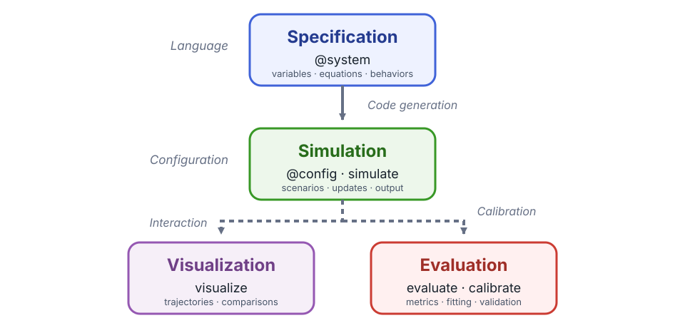

# [How Cropbox Works](@id cropbox-concepts)

Cropbox is a modeling framework rather than one particular crop model. It is
best understood as a small vocabulary for declaring a model graph. The graph
describes what each variable means and what it depends on; the framework turns
that graph into an ordered update routine.

## Core building blocks

A Cropbox model is built from five closely related elements: systems,
variables, dependencies, behaviors, and a shared context.

### System

A `System` is a reusable model component containing variables. A system can
represent a process such as phenology, an environment such as weather, or an
entire model. Systems are composed through mixins and through variables that
hold other systems.

### Variable

A variable has a short programmatic name, an optional alias, dependencies, a
formula or initial value, and an update behavior.

```julia
response(temperature, base): effective_temperature =>
    temperature - base ~ track(min = 0, u"K")
```

Here `response` depends on `temperature` and `base`; `effective_temperature` is
an alias; the expression is recalculated by `track`; `min = 0` applies a lower
bound to the stored value; and the result has units of kelvin.

### Dependency

Dependencies are listed in parentheses after the variable name. Cropbox orders
variables so a dependency is current before its consumer is evaluated. Ordinary
cycles are rejected; state that changes over time is expressed through a
behavior such as `accumulate`.

### Behavior

The word after `~` describes how a value changes:

| Behavior | Meaning | Typical use |
|---|---|---|
| `preserve` | Initialize once | parameter or constant |
| `track` | Recalculate on update | algebraic equation |
| `accumulate` | Integrate a rate over time | biomass or thermal time |
| `flag` | Track a Boolean condition | emergence, maturity, stop |

Tags refine a behavior. For example, `parameter`, `init`, `when`, `min`, and
`max` change configuration, initialization, conditional updates, and bounds.
Data input, interpolation, numerical solvers, and dynamic child systems use
additional behaviors documented in [Behaviors and Tags](@ref behaviors-and-tags).

### Context

Systems share a `Context` containing configuration and a `Clock`. A top-level
`Controller` creates that context. Child systems receive it from their parent,
which keeps time and configuration consistent across the model.

## Modeling workflow

Cropbox separates model development into three recurring phases. A
specification describes the model independently of a particular run,
simulation applies scenarios and advances model state, and the resulting data
support two complementary activities: visualization and evaluation.



### 1. Specification

Use `@system` to declare variables, dependencies, equations, and behaviors.
Cropbox parses this specification, analyzes its dependency graph, and generates
the Julia types and update routines used during simulation. Mixins compose
reusable systems, while `parameter` tags define the inputs that configuration
may supply. Unit tags make compatible conversion and dimensional checking part
of the specification.

```@example concepts
using Cropbox

@system TemperatureResponse begin
    T: temperature         => 20            ~ preserve(parameter, u"°C")
    Tb: base_temperature   => 5             ~ preserve(parameter, u"°C")

    Δt(context.clock.step): timestep        ~ preserve(u"hr")
    r(T, Tb, Δt): response => (T - Tb) / Δt ~ track(min = 0, u"K/hr")
end

@system Development(TemperatureResponse, Controller) begin
    progress(r) ~ accumulate(u"K")
end

config = @config TemperatureResponse => (
    T = 18,
    Tb = 4,
)
```

Short names keep dependencies and equations compact. Descriptive aliases such
as `temperature`, `base_temperature`, `timestep`, and `response` remain
available when reading an instance or selecting output. `Δt` reads the
configured `Clock.step`, so the response equation does not bake in a fixed
update interval. The configuration supplies plain numbers for `T` and `Tb`;
Cropbox applies their declared unit and displays them as `18 °C` and `4 °C`.

Continue with [DSL Syntax](@ref dsl-syntax), [System](@ref system), and
[Configure Models and Scenarios](@ref configuration-workflow). The
[Quick Start](@ref quick-start) develops a complete small specification.

### 2. Simulation

`@config` supplies parameter values and infrastructure settings without changing
the specification. `instance` constructs a model for interactive inspection.
`simulate` constructs and advances a fresh instance, applies stopping and
snapshot rules, and returns selected variables as a DataFrame. The same
specification can therefore be run with many scenarios and output selections.

```@example concepts
s = instance(Development; config)
current_response = s.response'

result = simulate(Development;
    config,
    stop = 3u"hr",
    target = [:response, :progress],
)

first(result, 3)
```

A system field is a Cropbox state object rather than a bare number; postfix `'`
or `value` retrieves its current value outside a declaration. See
[Model Execution](@ref model-execution) and
[Run Simulations and Shape Output](@ref simulation-workflow) for construction,
updates, stopping, snapshots, and output selectors.

### 3. Visualization and evaluation

`visualize` explores trajectories, scenarios, and observations.
`evaluate` compares model estimates with observed data using a selected metric,
and `calibrate` searches parameter ranges against that objective. Keep
calibration and independent validation separate.

```julia
visualize(result, :time, :progress; kind = :line)
```

Continue with [Inspect and Visualize Models](@ref inspection-workflow) and the
[Evaluate and Calibrate Models](@ref evaluation-tutorial) workflow.

## Where to go next

Follow the [Quick Start](@ref quick-start) to apply all three stages to a small
model, then choose a domain tutorial from the navigation. Use the workflow and
reference pages when you need more control over an individual stage.
