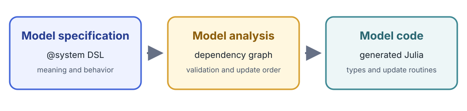

# [DSL Syntax](@id dsl-syntax)

Cropbox declarations resemble Julia, but `@system` parses them as a
domain-specific language. This reference describes the accepted public syntax
and the meaning of each part.



The declaration states what each variable means, how it behaves, and what it
depends on. Cropbox analyzes those dependencies, validates that a usable update
order exists, and generates the Julia model type and update routines. The DSL is
therefore declarative even though its expressions use familiar Julia syntax.

## System declaration

```text
@system name[{patches...}][(mixins...)] [<: supertype] begin
    # variable declarations...
end
```

The declaration block may be omitted for a system composed entirely from
mixins.

```julia
@system WeatherModel(Weather, Phenology, Controller)
```

### Name and mixins

```julia
@system Model(A, B, Controller) begin
    # variable declarations...
end
```

Definitions are combined from left to right. Later mixins take precedence when
the same public variable name is declared more than once; declarations in the
new block can complete or replace the merged result. Use `look(Model)` to verify
the resulting surface.

`Controller` is normally present only in a root system that will be passed to
`instance`, `simulate`, or `visualize`. Nested components receive context and
configuration from their parent.

## Variable declaration grammar

```text
name[(args...; kwargs...)][: alias] [=> body]
    ~ [behavior][::static_type|<:dynamic_type][(tags...)]
```

Every part except `name` is optional, although useful model variables normally
have a body, behavior, or explicit type.

```julia
@system Example(Controller) begin
    base: base_temperature                    => 5                  ~ preserve(parameter, u"°C")
    temperature                               => 20                 ~ preserve(parameter, u"°C")
    rate(temperature, base): development_rate => temperature - base ~ track(min = 0, u"K")
end
```

### Name and alias

`name` is the identifier used in equations and configuration. `alias` is a
second public name for the same state object.

```julia
LAI: leaf_area_index ~ track
```

Both `s.LAI` and `s.leaf_area_index` refer to the same state. Configuration and
output should normally use the short declared name because it is less likely to
change than descriptive prose.

A name beginning with one underscore is private to the declaring system and is
canonicalized internally. Double-underscore names are not canonicalized this
way. Private-name behavior is primarily for package authors; do not depend on
the generated internal name in user code.

### Dependencies

Positional entries bind values under their declared names.

```julia
mean(TMAX, TMIN) => (TMAX + TMIN) / 2 ~ track(u"°C")
```

A default-like entry changes the local binding name or selects a variable from a
nested system.

```julia
date(t = calendar.time)                            => Dates.Date(t) ~ track::date
response(T = weather.temperature, k = coefficient) => T * k         ~ track
```

Boolean expressions can be dependencies. Cropbox extracts the referenced
variables and preserves the expression.

```julia
active(emerged & !mature) ~ flag
```

Entries after `;` are explicit arguments of a function-like behavior rather
than automatically bound model dependencies. They are used by `call` and
`integrate`.

```julia
conductivity(curve; water_content) => curve(water_content) ~ call(u"m/d")
area(scale; x)                     => scale * x^2          ~ integrate(from = 0, to = 1)
```

### Body

The expression after `=>` computes an initial or updated value according to the
behavior.

```julia
x(a, b) => a + b ~ track
```

A `begin ... end` block may hold a longer equation. Its last expression becomes
the result.

```julia
stress(T, lower, upper) => begin
    raw = (T - lower) / (upper - lower)
    raw
end ~ track(min = 0, max = 1)
```

For behaviors that support them, the `min` and `max` tags bound the value after
evaluation, providing the DSL equivalent of clamping without hiding the bounds
inside the equation body.

When the body is omitted, many behaviors use the first dependency or a
behavior-specific default. Prefer an explicit body when omission would make the
scientific meaning unclear.

### Behavior

The behavior after `~` controls storage and updates. Common forms are:

```julia
p               => 1           ~ preserve(parameter)
y(x)            => 2x          ~ track
z(y)                           ~ accumulate
done(z, target) => z >= target ~ flag
```

See [Behaviors and Tags](@ref behaviors-and-tags) for the complete user-facing
inventory and supported tag combinations.

Tag order does not change the meaning, but this documentation follows a
consistent reading order: semantic tags such as `parameter`, `min`, `max`, and
`when` come first, while the unit string comes last. For example, write
`preserve(parameter, u"kg")` and `track(min = 0, u"K")`.

### Static and dynamic type annotations

`::T` resolves a static Cropbox type; `<:T` uses a dynamic subtype-compatible
type.

```julia
count               => 0 ~ preserve::int
date(calendar.date)      ~ track::date
child                    ~ ::ChildSystem
resource                 ~ <:AbstractResource
```

Built-in aliases include:

| Alias | Julia type |
|---|---|
| `int`, `uint` | `Int64`, `UInt64` |
| `float`, `bool` | `Float64`, `Bool` |
| `sym`, `str` | `Symbol`, `String` |
| `date`, `datetime` | `Date`, `ZonedDateTime` |
| `∅`, `_` | `Nothing`, `Missing` |

`T[]` denotes `Vector{T}`. A type can also use a braced union such as
`::{sym|∅}`. Most numeric behaviors default to `Float64`, `flag` defaults to
`Bool`, `provide` to a DataFrame, and `produce` to a system vector.

### Tags

Tags are comma-separated flags, keyword assignments, or a unit literal.

```julia
p       => 1 ~ preserve(parameter, min = 0, u"kg")
x(rate)      ~ accumulate(init = x0, when = active, u"kg")
```

The unit literal is shorthand for `unit = u"..."`. Unsupported tags cause an
error while expanding `@system`; tags are not silently ignored.

## Plain typed variables and child systems

A declaration does not require a Cropbox behavior.

```julia
calendar(context, config)                                    ~ ::Calendar
children(context)         => [Child(; context) for _ in 1:3] ~ ::Vector{Child}
```

These declarations construct or reference ordinary values and systems using the
generated constructor/update rules. They are common in composite models. Use a
behavior when the value needs behavior-specific storage, tags, or updates.

## Context and override patterns

Reusable components commonly declare a context placeholder:

```julia
context ~ ::Context(override)
```

The parent then constructs the child with its own context. Similarly, a mixin
can declare a placeholder behavior with `override`, and the final system can
supply the concrete declaration. An override declaration cannot carry an update
body; it receives its value from construction or a replacing declaration.

## Advanced system headers

The following header forms are useful for framework components and specialized
composition, but they are not part of most model declarations.

### Public supertype

```julia
@system DailyClock(Clock) <: Clock begin
    # ...
end
```

`<:` assigns the public system supertype. Use it when another declaration
expects a family of compatible systems.

### Header patches

Header braces support type substitution and system constants.

```julia
@system DailyContext{Clock => DailyClock}(Context) <: Context
@system S{coefficient = 2}(Controller) begin
    y => coefficient * 3 ~ preserve
end
```

Type substitution rewrites declarations that refer to the old type so they use
the replacement type. Constants are resolved while Cropbox constructs the
generated code. Keep patches close to the system that needs them and explain
them in the system docstring.

## Documentation strings

Julia docstrings immediately before a system or variable declaration are stored
for `look` and `@look`.

```julia
"""Daily thermal-time model."""
@system ThermalTime(Controller) begin
    """Base temperature below which no thermal time is accumulated."""
    Tb => 5 ~ preserve(parameter, u"°C")
end
```

Document units, valid ranges, source references, and whether a parameter is
species-, cultivar-, or experiment-specific.

## Reading a declaration reliably

When a line is unfamiliar, identify these parts in order:

1. public name and alias;
2. positional dependencies and their local bindings;
3. explicit function arguments after `;`;
4. body expression;
5. behavior and value type;
6. unit, initialization, bounds, conditions, and ownership tags.

Then inspect it with `look(System, :variable)` and trace its dependencies before
changing configuration.
