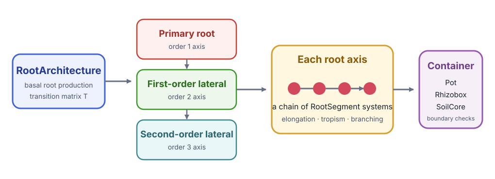
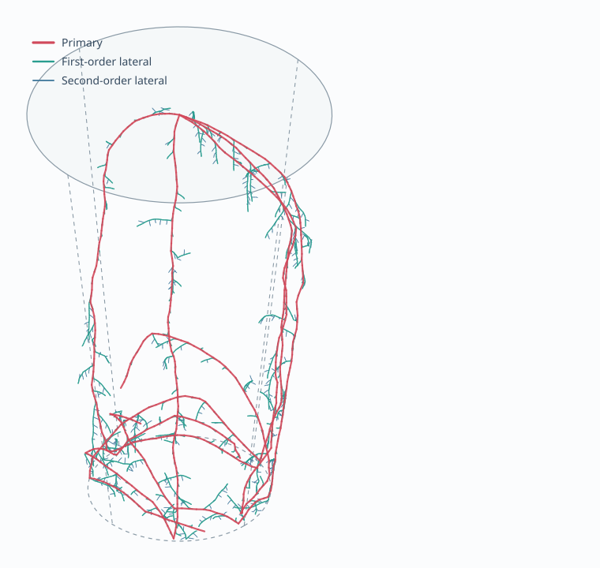

# [Root System Architecture](@id croprootbox-tutorial)

[CropRootBox.jl](https://github.com/cropbox/CropRootBox.jl) implements a dynamic
root system architecture inspired by CRootBox. It demonstrates three Cropbox
features that ordinary process models use less often: stochastic parameters,
external geometric resources, and dynamic child systems.

The root-growth rules originate from [*CRootBox: a structural–functional
modelling framework for root systems*](https://doi.org/10.1093/aob/mcx221)
(*Annals of Botany*, 2018). CropRootBox is a smaller Julia proof of concept,
introduced with [*Cropbox: a declarative crop modelling
framework*](https://doi.org/10.1093/insilicoplants/diac021) (*in silico Plants*,
2023); it is not a complete reimplementation of CRootBox.

Follow-on studies show how this implementation has been used and extended:

- [resource-specific elongation and branching in perennial grasses](https://doi.org/10.3389/fpls.2023.1146681)
  used CropRootBox to compare simulated root length by branching order;
- [time-series image phenotyping of adventitious roots](https://doi.org/10.34133/plantphenomics.0127)
  connected RhizoVision measurements to CropRootBox parameterization and
  evaluation in two and three dimensions;
- [switchgrass root plasticity under different phosphorus forms](https://doi.org/10.1007/s11104-024-07178-5)
  continued the same root-box and architecture-modeling line for nutrient
  acquisition.

!!! note "Separate model package"
    CropRootBox is not a dependency of the Cropbox documentation project. Run
    this tutorial in an environment where `CropRootBox` is installed. An
    interactive rendering backend such as GLMakie is optional and is not
    required for configuration, simulation, summaries, or geometry export.

## Install and load

```julia
using Pkg
Pkg.add("Cropbox")
Pkg.add("CropRootBox")

using Cropbox
using CropRootBox
```

## Understand the hierarchy

`RootArchitecture` coordinates root types such as `PrimaryRoot`,
`FirstOrderLateralRoot`, and `SecondOrderLateralRoot`. Start with their parameter
surfaces.

```julia
parameters(CropRootBox.RootArchitecture; alias = true)
parameters(CropRootBox.BaseRoot; alias = true)
look(CropRootBox.RootArchitecture)
```

The transition matrix `T` controls which root type can produce another type.
Parameters such as basal length, apical length, inter-lateral distance, maximum
length, growth rate, insertion angle, and radius describe each root class.



*`RootArchitecture` produces root axes according to transition matrix `T`.
Each axis is itself a chain of `RootSegment` systems whose new positions are
checked against a geometric container.*

The most useful parameters to recognize are:

| Parameter | Meaning in the implementation |
|---|---|
| `lb`, `la` | basal and apical zone lengths |
| `ln` | spacing between lateral branches |
| `lmax` | maximum length of one root axis |
| `r` | potential elongation rate |
| `Δx` | target axial segment length and geometric resolution |
| `θ`, `σ` | mean insertion angle and its spatial variation |
| `N` | controls how many candidate tropism directions are compared; a fractional part is handled probabilistically |
| `a` | root radius/thickness parameter retained in geometry output |

Rows of `T` are parent types and columns are possible child types. Entries are
selection weights: the maize matrix below makes primary roots produce
first-order laterals and first-order laterals produce second-order laterals.
If a row sums to less than one, the remaining probability produces no branch.

## Configure a small maize architecture

```julia
root_maize = @config (
    CropRootBox.RootArchitecture => :maxB => 5,
    CropRootBox.BaseRoot => :T => [
        # P F S
          0 1 0;  # primary
          0 0 1;  # first-order lateral
          0 0 0;  # second-order lateral
    ],
    CropRootBox.PrimaryRoot => (
        lb = 0.1 ± 0.01,
        la = 18.0 ± 1.8,
        ln = 0.6 ± 0.06,
        lmax = 89.7 ± 7.4,
        r = 6.0 ± 0.6,
        Δx = 0.5,
        σ = 10,
        θ = 80 ± 8,
        N = 1.5,
        a = 0.04 ± 0.004,
        color = CropRootBox.RGBA(1, 0, 0, 1),
    ),
    CropRootBox.FirstOrderLateralRoot => (
        lb = 0.2 ± 0.04,
        la = 0.4 ± 0.04,
        ln = 0.4 ± 0.03,
        lmax = 0.6 ± 1.6,
        r = 2.0 ± 0.2,
        Δx = 0.1,
        σ = 20,
        θ = 70 ± 15,
        N = 1,
        a = 0.03 ± 0.003,
        color = CropRootBox.RGBA(0, 1, 0, 1),
    ),
    CropRootBox.SecondOrderLateralRoot => (
        lb = 0,
        la = 0.4 ± 0.02,
        ln = 0,
        lmax = 0.4,
        r = 2.0 ± 0.2,
        Δx = 0.1,
        σ = 20,
        θ = 70 ± 10,
        N = 2,
        a = 0.02 ± 0.002,
        color = CropRootBox.RGBA(0, 0, 1, 1),
    ),
)
```

`mean ± standard_deviation` creates a distribution sampled during instance
construction. It is configuration data, not an error bar attached to one fixed
value. The samples are also constrained by declaration bounds where those
bounds exist; inspect a constructed instance when a distribution is close to a
physical limit.

## Construct the container and architecture

```julia
container = instance(CropRootBox.Pot)

root = instance(CropRootBox.RootArchitecture;
    config = root_maize,
    options = (; box = container),
    seed = 0,
)
```

The container is passed through `options` because it is an external geometric
resource required by construction, not a scalar parameter stored in the normal
configuration tree.

`seed=0` makes stochastic draws and production choices reproducible. Use the
same seed for controlled treatment comparisons and different explicit seeds for
independent replicates.

## Simulate growth

```julia
result = simulate!(root; stop = 100u"d")
result[end, :time]
```

`simulate!` is appropriate because the final geometric instance is needed for
export. The `root` object has been mutated to day 100.

Do not call `simulate!(root; stop=100u"d")` again expecting a replicate; it
continues the existing architecture. Construct a new seeded instance instead.



*A representative 15-day realization using the configuration above and
`seed=0`. The shorter time keeps individual root orders legible: primary roots
are red, first-order laterals green, and second-order laterals blue. The dashed
frustum is the pot boundary. The image is projected from the model's actual
segment coordinates.*

## Gather segments and calculate summaries

```julia
segments = gather!(root, CropRootBox.BaseRoot;
    callback = CropRootBox.gatherbaseroot!,
)

total_length = sum(segment.length' for segment in segments)
segment_count = length(segments)
axis_count = count(segment -> iszero(segment.zi'), segments)
```

Despite the callback name, the traversal visits the chained `BaseRoot`
objects that make up root geometry. `length(segments)` is therefore a segment
count, not the number of complete root axes. A newly produced axis starts with
`zi == 0`, which gives the separate `axis_count` above. Summing segment lengths
does give total root length.

For a time series of non-scalar structure, use the `simulate` do-block form:

```julia
summary = simulate(CropRootBox.RootArchitecture;
    config = root_maize,
    options = (; box = container),
    seed = 0,
    stop = 100u"d",
    snap = 10u"d",
    target = [],
) do rows, s
    segments = gather!(s, CropRootBox.BaseRoot;
        callback = CropRootBox.gatherbaseroot!)
    rows[1][:segment_count] = length(segments)
    rows[1][:axis_count] = count(segment -> iszero(segment.zi'), segments)
    rows[1][:total_length] = isempty(segments) ? 0.0u"cm" :
        sum(segment.length' for segment in segments)
end
```

`target=[]` keeps the ordinary output narrow; the time index remains, and the
do-block adds the three structural summaries. Snapshot infrequently enough to
keep traversal and output costs under control. The initial architecture is
also collected when the initial time satisfies the snapshot rule.

## Summarize length by soil depth

The test examples use `SoilLayer` containers as geometric predicates. The
following creates three 10 cm layers and adds one length column per layer
inside the same do-block pattern:

```julia
layers = [
    instance(CropRootBox.SoilLayer;
        config = CropRootBox.SoilLayer => (
            d = depth,
            t = 10u"cm",
        ),
    )
    for depth in (0:10:20)u"cm"
]

for (i, layer) in enumerate(layers)
    lengths = [
        segment.length'
        for segment in segments
        if segment.ii(layer)
    ]
    rows[1][Symbol("layer_", i)] = isempty(lengths) ? 0.0u"cm" : sum(lengths)
end
```

This classifies a segment using the position tested by `ii`; it is a practical
depth summary, not an exact clipping of every segment at layer boundaries. Use
shorter `Δx` or geometric intersection code if boundary precision matters.

## Export geometry

The package can export the completed architecture without a plotting dependency.

```julia
CropRootBox.writevtk("maize-root", root)
CropRootBox.writestl("maize-root", root)
```

VTK is useful for scientific visualization and attribute inspection; STL is a
surface format. Choose the format according to the downstream tool and retain
the seed and configuration alongside exported files.

`writepvd` exports a time-indexed VTK collection by running fresh simulations:

```julia
CropRootBox.writepvd("maize-series", CropRootBox.RootArchitecture;
    config = root_maize,
    options = (; box = container),
    seed = 0,
    stop = 30u"d",
    snap = 5u"d",
)
```

This writes several files and a collection directory, so use it only when a
geometry time series is needed. `writevtk` or `writestl` is cheaper for one
selected final state.

Interactive rendering requires an additional Makie backend. It is deliberately
optional:

```julia
using GLMakie
scene = CropRootBox.render(root)
GLMakie.save("maize-root.png", scene)
```

## Replicates and treatments

Use an explicit loop when both treatment and stochastic replicate identity must
be visible:

```julia
treatments = [
    (name = "baseline", config = root_maize),
    (name = "slower primary", config = @config(
        root_maize,
        CropRootBox.PrimaryRoot => :r => 4u"cm/d",
    )),
]

outputs = []
for treatment in treatments, seed in 1:10
    container = instance(CropRootBox.Pot)
    result = simulate(CropRootBox.RootArchitecture;
        config = treatment.config,
        options = (; box = container),
        seed,
        stop = 100u"d",
        snap = 10u"d",
    ) do rows, s
        # add summaries
    end
    result.treatment .= treatment.name
    result.replicate .= seed
    push!(outputs, result)
end
```

Do not share one mutable container or output accumulator across threaded
scenario simulations unless the model explicitly guarantees thread safety.

## Performance checklist

- use a coarse enough `Δx` for the scientific question;
- reduce `maxB` while developing the analysis;
- restrict simulation duration and snapshot frequency;
- collect aggregate metrics instead of full geometry at every step;
- export geometry only at selected times;
- warm up one small instance before benchmarking;
- separate model construction, simulation, traversal, and file-writing time.

The generic traversal functions used here are described in [Values, Units, and
Structure](@ref utility-api); simulation callbacks and random-seed
behavior are detailed in [Simulation](@ref Simulation1).
