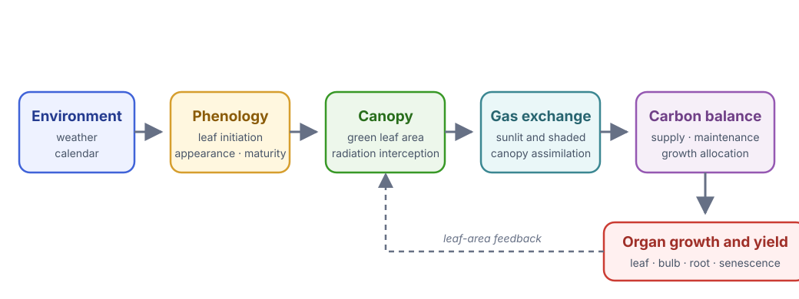
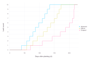
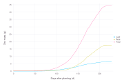
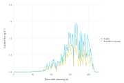
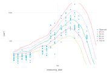
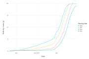

# [Garlic Growth Model](@id garlic-tutorial)

[Garlic.jl](https://github.com/cropbox/Garlic.jl) is a process-based hardneck
garlic model implemented as a set of Cropbox systems. It is a useful example of
composition across phenology, weather, radiation, gas exchange, morphology,
carbon balance, and organ growth.

The model was developed in two stages: leaf development and expansion in
[*A process-based model for leaf development and growth in hardneck garlic*](https://doi.org/10.1093/aob/mcz060)
(*Annals of Botany*, 2019), followed by whole-plant carbon balance, biomass, and
yield in [*An Integrative Process-Based Model for Biomass and Yield Estimation
of Hardneck Garlic*](https://doi.org/10.3389/fpls.2022.783810) (*Frontiers in
Plant Science*, 2022). The process chain below connects those two scopes.

!!! note "Separate model package"
    Garlic is not a dependency of the Cropbox documentation project. Run this
    tutorial in an environment where `Garlic` is installed. The basic workflow
    follows the model package tests and the 2025 Cropbox workshop.

## Install and load

```julia
using Pkg
Pkg.add("Cropbox")
Pkg.add("Garlic")

using Cropbox
using Garlic
import Dates
```

## Inspect the model before running it

```julia
look(Garlic.Model)
parameters(Garlic.Model; alias = true)
parameters(Garlic.Model;
    alias = true,
    recursive = true,
    exclude = (Context,),
)
```

The recursive parameter list is intentionally large. A whole-plant model is
easier to understand component by component. Useful starting systems include
`Garlic.Phenology`, `Garlic.Photosynthesis`, `Garlic.Weight`, and `Garlic.Water`.

Keep this process chain in mind while reading the output:

| Stage | Useful outputs | Question answered |
|---|---|---|
| calendar and phenology | `time`, `DAP`, leaf counts | Is the plant in the expected stage? |
| canopy development | `green_leaf_area`, `LAI` | How much active leaf area intercepts light? |
| assimilation and carbon | `A_gross`, `carbon_supply`, `total_carbon` | How much carbon is available for growth? |
| allocation and survival | organ masses, dropped area | Where did that carbon go, and how much tissue remains alive? |



*The model proceeds from environment and phenology to canopy gas exchange and
carbon allocation. Simulated organ growth changes green leaf area, closing the
main feedback loop.*

The final mass curve is an outcome of this chain, not a growth curve fitted
directly to time.

## Use a packaged configuration

Garlic includes complete parameter and environment sets under `Garlic.Examples`.
The following set represents the Korean Mountain cultivar grown in Seattle for
an experiment used by the model.

```julia
config = @config Garlic.Examples.AoB.KM_2014_P2_SR0
```

Keep the example configuration intact as a reproducible base. Apply small
scenario patches after it rather than copying hundreds of values into a new
tuple.

## Run one daily-output simulation

The model updates hourly. Its `calendar.count` value gives the number of updates
between configured start and end dates. Save one row at noon each day:

```julia
result = simulate(Garlic.Model;
    config,
    stop = "calendar.count",
    snap = s -> Dates.hour(s.calendar.time') == 12,
)
```

`stop` and output paths may be strings when they refer to nested systems. The
snapshot function receives the root instance and uses `'` to retrieve the
calendar value.

Check completion before plotting:

```julia
result[end, [:DAP, :leaves_initiated, :total_mass]]
```

Also inspect the first and last `time` values and the number of saved rows. If
the last date is unexpectedly early, check the packaged calendar, weather
coverage, and the `snap` predicate before interpreting plant output.

## Follow leaf development

```julia
visualize(result,
    :DAP,
    [:leaves_appeared, :leaves_mature, :leaves_dropped];
    names = ["Appeared", "Mature", "Dropped"],
    kind = :step,
)
```



*Initiated leaves appear, mature, and eventually drop in a biologically ordered
sequence. Step geometry preserves the count-variable interpretation.*

A step plot matches count variables better than an interpolated line. Plot
initiated and appeared leaves together when diagnosing phenology.

```julia
visualize(result,
    :DAP,
    [:leaves_initiated, :leaves_appeared];
    kind = :step,
)
```

`leaves_initiated` counts primordia already formed at the apex;
`leaves_appeared` counts leaves visible above the soil or sheath. Mature and
dropped counts describe later states of those leaves. Their ordering provides
a quick consistency check even before leaf area is plotted.

## Leaf area and biomass

```julia
visualize(result, :DAP, :green_leaf_area; kind = :line)

visualize(result,
    :DAP,
    [:leaf_mass, :bulb_mass, :total_mass];
    names = ["Leaf", "Bulb", "Total"],
    kind = :line,
)
```



*Leaf, bulb, and total dry mass from the packaged Korean Mountain cultivar
configuration.*

Interpret these outputs together. Biomass partitioning depends on phenological
stage, while green leaf area feeds back into radiation interception and carbon
supply.

## Trace the carbon path

The workshop follows gross canopy photosynthesis through carbon supply to the
carbon available for organ growth. These variables have different units, so
plot them separately rather than forcing them onto one axis.

```julia
visualize(result, :DAP, :A_gross; kind = :line)

visualize(result,
    :DAP,
    [:carbon_supply, :total_carbon];
    names = ["Supply", "Available for growth"],
    kind = :line,
)

visualize(result,
    :DAP,
    :(total_carbon / total_mass);
    ylab = "Relative growth rate",
    kind = :line,
)
```



*Daily carbon supply and carbon available for growth. Weather-driven variation
is retained rather than smoothed away.*

`A_gross` is a canopy flux. `carbon_supply` converts assimilated carbon to the
plant basis and releases it from the carbon pool; `total_carbon` also reflects
maintenance and growth conversion before partitioning. The derived ratio is a
diagnostic, not a separately fitted model parameter. A strange final mass can
therefore be traced upstream instead of corrected immediately with an
allocation parameter.

## Compare observations and a parameter sweep

The workshop overlays measured leaf area with several values of `LM_min`, the
minimum length of the model's longest leaf. This combines an observation plot
and a grouped model sweep without changing the packaged base configuration.

```julia
using CSV
using DataFrames

observed = CSV.read(
    Garlic.datapath("Korea/ricca_2014_field.csv"),
    DataFrame,
) |> unitfy

p = visualize(observed, :measuring_date, :leaf_area;
    name = "Observed",
    kind = :scatter,
)

visualize!(p, Garlic.Model, :time, :green_leaf_area;
    config = Garlic.Examples.RCP.ND_RICCA_2014_field,
    stop = "calendar.count",
    snap = 1u"d",
    group = Garlic.Leaf => :LM_min => [60, 70, 80, 90, 100],
    legend = "LM_min",
    kind = :line,
)
```



*Observed leaf area overlaid with an `LM_min` sensitivity sweep. The plot shows
whether the parameter moves the trajectory as expected; it is not by itself a
calibration result.*

Treat this first as a sensitivity check: does the parameter move the output in
the expected direction and period? Selecting the visually closest line is not
calibration. Formal fitting also needs a stated metric, defensible bounds, and
independent validation; see [Model Evaluation and Calibration](@ref
evaluation-tutorial).

## Compare planting dates

The 2025 workshop varies one parameter while retaining a packaged regional
configuration. The pattern is:

```julia
using TimeZones

base = Garlic.Examples.RCP.ND_RICCA_2014_field
planting_dates = [
    ZonedDateTime(2014,  9, 1, tz"Asia/Seoul"),
    ZonedDateTime(2014, 10, 1, tz"Asia/Seoul"),
    ZonedDateTime(2014, 11, 1, tz"Asia/Seoul"),
    ZonedDateTime(2014, 12, 1, tz"Asia/Seoul"),
]

visualize(Garlic.Model, :time, :bulb_mass;
    config = (
        base,
        Calendar => :init => ZonedDateTime(2014, 9, 1, tz"Asia/Seoul"),
    ),
    stop = "calendar.count",
    snap = 1u"d",
    group = Garlic.Phenology => :planting_date => planting_dates,
    legend = "Planting date",
    names = ["Sep", "Oct", "Nov", "Dec"],
    kind = :line,
)
```



*Changing planting date shifts the timing of bulb growth under the shared
weather record. Comparing final values alone would hide most of this response.*

For a scientific comparison, ensure every planting date has sufficient weather
coverage and use the same cultivar, site, soil, and harvest rule.

## Collect organ-level output

Dynamic nodal units and leaves are not ordinary scalar columns. `snatch` can add
one column per leaf rank at snapshot time:

```julia
ranked = simulate(Garlic.Model;
    config,
    index = :time,
    target = [],
    stop = "calendar.count",
    snap = 1u"d",
    snatch = (rows, s) -> begin
        for nu in s.NU
            rows[end][Symbol(nu.rank')] = nu.leaf.green_area'
        end
    end,
)
```

This is intentionally advanced. The set of columns can change as organs are
produced, so downstream code must handle missing ranks. Prefer aggregate outputs
for routine calibration and reserve organ-level extraction for morphology
questions. The general `snatch` lifecycle and output rules are documented in
[Simulation](@ref Simulation1).

## A diagnostic order for whole-plant results

When yield or bulb mass looks wrong, inspect processes upstream in this order:

1. calendar, weather coverage, and planting date;
2. development phase and leaf initiation/appearance;
3. green leaf area and `LAI`;
4. sunlit/shaded irradiance and gas exchange;
5. carbon supply and growth rate;
6. organ partitioning, senescence, and final mass.

Changing a final partition parameter before checking upstream limitations can
fit one output while making the internal model inconsistent.

For plotting variants used above—including grouped systems, observation
overlays, and expression targets—see [Visualization](@ref Visualization1).
