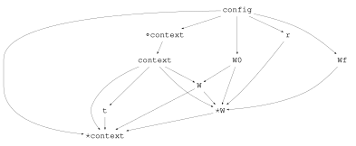

# [From an Equation to a Cropbox Model](@id logistic-growth-tutorial)

This tutorial translates a logistic growth equation into a Cropbox
specification, configures a scenario, runs the model, and examines the result.
It follows the equation-to-model sequence used in Cropbox courses and workshops.

## Start from the process equation

Let whole-plant biomass ``W`` follow logistic growth:

```math
\frac{dW}{dt} = rW\left(1 - \frac{W}{W_f}\right),
\qquad W(0) = W_0.
```

Before writing code, identify the role and behavior of every symbol.

| Symbol | Meaning | Cropbox role |
|---|---|---|
| ``r`` | relative growth rate | configurable value preserved during a run |
| ``W_f`` | potential final biomass | configurable value preserved during a run |
| ``W_0`` | initial biomass | configurable initial value |
| ``W`` | current biomass | state accumulated from its growth rate |

This semantic inventory is the bridge between an equation and the model DSL.

## Specify the model

```@example logistic
using Cropbox
using DataFrames

@system LogisticGrowth(Controller) begin
    r: growth_rate       => 0.05                 ~ preserve(parameter, u"g/g/d")
    Wf: final_biomass    => 300                  ~ preserve(parameter, u"g")
    W0: initial_biomass  => 0.25                 ~ preserve(parameter, u"g")
    W(W, r, Wf): biomass => r * W * (1 - W / Wf) ~ accumulate(init = W0, u"g")

    t(context.clock.time): time ~ track(u"d")
end
```

Read the main state declaration from left to right:

- `W(W, r, Wf)` names the state and its dependencies. Including `W` expresses
  recurrence through the `accumulate` behavior.
- `: biomass` provides a descriptive alias.
- the expression after `=>` computes the current growth rate;
- `accumulate(init = W0, u"g")` integrates that rate over simulation time,
  starting from `W0` and storing biomass in grams.

The declaration focuses on meaning and behavior. Cropbox derives the dependency
graph, update order, state types, and update routines from it.

## Inspect the specification

Check the configurable surface before building a scenario.

```@example logistic
parameters(LogisticGrowth)
```

Use `look` for the complete declaration or one variable.

```@example logistic
look(LogisticGrowth, :W)
```

`Cropbox.dependency` exposes the graph Cropbox uses to order declarations and
update stages:

```@example logistic
d = Cropbox.dependency(LogisticGrowth)
println(repr(MIME("text/plain"), d))
nothing
```

The text form gives the generated update order. The SVG below is written
directly from the same graph object:

```julia
Cropbox.writeimage("logistic-dependency", d; format = :svg)
```



*Direct `writeimage` output from `dependency(LogisticGrowth)`. Generated stages
such as `∘context`, `⋆context`, and `⋆W` remain visible because this is the
actual scheduling graph rather than a redrawn scientific summary.*

## Configure a scenario

Defaults make the model runnable, but an external configuration keeps the
scientific specification separate from a particular experiment.

```@example logistic
config = @config (
    LogisticGrowth => (
        r = 0.05,
        Wf = 300,
        W0 = 0.25,
    ),
    Clock => :step => 1u"d",
)
```

The system type keys allow Cropbox to validate parameter names and units while
the configuration is created.

## Run the simulation

Request an explicit index and target so the output contract is clear.

```@example logistic
result = simulate(LogisticGrowth;
    config,
    stop = 300u"d",
    index = :t,
    target = :W,
)

first(result, 5)
```

The model updates at `Clock.step`. The returned DataFrame includes the initial
state and subsequent daily snapshots through the stop time.

## Visualize growth

```@example logistic
visualize(result, :t, :W; kind = :line)
```

The S-shaped curve is not encoded as plotting logic. It emerges from repeated
simulation of the specified biomass rate.

## Compare with observations

Evaluation uses the same specification and configuration. Here a small data set
stands in for measured biomass.

```@example logistic
observations = DataFrame(
    t = [0, 100, 200, 300]u"d",
    W = [0.25, 33, 284, 300]u"g",
)

evaluate(LogisticGrowth, observations;
    config,
    index = :t,
    target = :W,
    stop = 300u"d",
    metric = :rmse,
)
```

`calibrate` extends this step by searching bounded parameter ranges. Keep the
data used for calibration separate from independent validation data; see
[Evaluate and Calibrate Models](@ref evaluation-tutorial) for the full workflow.

## Continue

- [DSL Syntax](@ref dsl-syntax) explains every declaration component.
- [Configure Models and Scenarios](@ref configuration-workflow) covers merging
  configurations and parameter sweeps.
- [Run Simulations and Shape Output](@ref simulation-workflow) covers stopping,
  snapshots, and output selectors.
- [Weather-driven Phenology](@ref phenology-tutorial) adds calendar time and
  tabular weather input.
