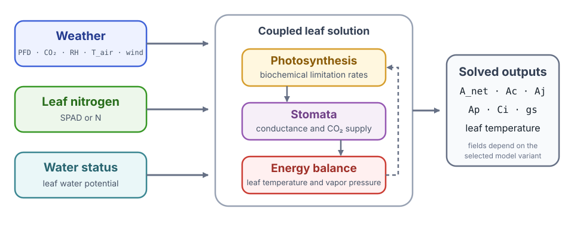
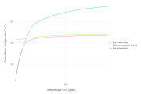
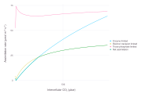
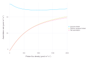
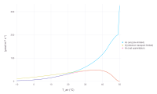
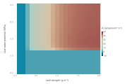
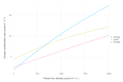

# [Leaf Gas Exchange](@id leaf-gas-exchange-tutorial)

This case study uses
[LeafGasExchange.jl](https://github.com/cropbox/LeafGasExchange.jl), a Cropbox
model coupling C₃ or C₄ biochemistry, Ball–Berry or Medlyn stomatal conductance,
and leaf energy balance. It demonstrates how to inspect an existing model and
calculate response curves or grids without editing its equations.

The coupled formulation and its comparison of stomatal-conductance models are
described in [*Coupled Gas-Exchange Model for C4 Leaves Comparing Stomatal
Conductance Models*](https://doi.org/10.3390/plants9101358) (*Plants*, 2020).
The article is the scientific starting point for this tutorial; the package is
the executable implementation.

!!! note "Separate model package"
    LeafGasExchange is not a dependency of the Cropbox documentation project.
    Run this tutorial in your own Julia environment. The commands are based on
    the package's current examples and Cropbox integration tests.

## Install and load

```julia
using Pkg
Pkg.add("Cropbox")
Pkg.add("LeafGasExchange")

using Cropbox
using LeafGasExchange
```

The main leaf-level combinations are:

| System | Photosynthesis | Stomata |
|---|---|---|
| `ModelC3BB` | C₃ | Ball–Berry |
| `ModelC3MD` | C₃ | Medlyn |
| `ModelC4BB` | C₄ | Ball–Berry |
| `ModelC4MD` | C₄ | Medlyn |

Canopy variants add `C` to the name, for example `ModelC4MDC`.

The model is easier to read if its variables are separated into inputs, solved
states, and rates:

| Role | Variables | Meaning |
|---|---|---|
| environment | `PFD`, `CO2`, `RH`, `T_air`, `wind` | light, atmospheric CO₂, humidity, air temperature, and wind speed |
| leaf status | `N`, `WP_leaf`/`Ψv` | leaf nitrogen and leaf water potential |
| coupled solution | `Ci`, `gs`, `T` | intercellular CO₂, stomatal conductance, and leaf temperature |
| photosynthesis | `Ac`, `Aj`, `Ap`, `A_net` | biochemical limitation rates and resulting net assimilation |



*Weather, leaf nitrogen, and water status enter a coupled solution. Changing
stomatal conductance also changes internal CO₂ and leaf temperature, so the
three process blocks cannot be diagnosed independently.*

Code identifiers and mathematical symbols serve different purposes in this
guide. For example, model variable `Ap` represents the C₃ limitation rate
``A_p``, and `Ci` stores intercellular CO₂ concentration ``C_i``. Identifiers
remain monospace; symbols used to explain an equation are typeset as math.

The figures use the conventional short labels ``A_c``, ``A_j``, and ``A_n``.
They correspond to model variables `Ac`, `Aj`, and `A_net`; the implementation
spells out net assimilation as `A_net` rather than defining a separate `An`
field.

`Ap` belongs to the C₃ model. The C₄ model instead resolves carboxylation-side
`Ac` from Rubisco and PEP sub-processes, together with
electron-transport-limited `Aj`. The model solves `Ci`, `gs`, and leaf
temperature together, so none of those outputs should be interpreted as an
independent input.

## Inspect the configuration surface

```julia
parameters(LeafGasExchange.ModelC4MD; alias = true)
parameters(LeafGasExchange.ModelC4MD;
    alias = true,
    recursive = true,
    exclude = (Context,),
)
```

The recursive list is long. Start with the nonrecursive surface, then inspect a
specific component such as `Weather`, `C4`, `StomataMedlyn`, or `Nitrogen`.

```julia
look(LeafGasExchange.ModelC4MD)
look(LeafGasExchange.ModelC4MD, :A_net)
```

## Define one leaf environment

```julia
base = @config (
    LeafGasExchange.Weather => (
        PFD = 1500,
        CO2 = 400,
        RH = 60,
        T_air = 30,
        wind = 2.0,
    ),
    LeafGasExchange.Nitrogen => (
        SPAD = 60,
    ),
    LeafGasExchange.StomataTuzet => (
        sf = 2.3,
        Ψf = -1.2,
    ),
)
```

Plain numbers are interpreted in the units declared by each parameter. For a
published analysis, record the parameter source and use explicit units wherever
the input could be ambiguous.

Create an instance to check one condition before calculating a response curve:

```julia
s = instance(LeafGasExchange.ModelC4MD; config = base)
(A_net = s.A_net', Ci = s.Ci', gs = s.gs', T_leaf = s.T')
```

If this fails, a response curve will fail too. Inspect environmental units and
solver bounds first. If it succeeds, check that all four values are finite and
biologically plausible before changing any biochemical parameter.

## CO₂-response curve

An ``A``–``C_i`` curve relates assimilation ``A`` to intercellular CO₂
``C_i``. The test suite avoids zero atmospheric CO₂ because it does not bracket
a useful coupled solution. Use a positive configured range.

```julia
co2 = LeafGasExchange.Weather => :CO2 => 10:10:1500

visualize(LeafGasExchange.ModelC4MD,
    :Ci,
    [:Ac, :Aj, :A_net];
    config = base,
    xstep = co2,
    names = [
        "Ac (enzyme-limited)",
        "Aj (electron transport-limited)",
        "An (net assimilation)",
    ],
    kind = :line,
)
```



*C₄ assimilation and its biochemical limitation rates across the configured
CO₂ range. The horizontal axis is solved `Ci`, not configured atmospheric
`CO2`.*

`xstep` changes configured atmospheric CO₂ while `Ci` is plotted from the model
solution. This distinction matters: the configured input and displayed x-axis
need not be the same variable.

Read the curve from the limitation rates toward `A_net`. In the C₃ model, net
assimilation ``A_{net}`` follows the lowest active rate among ``A_c``, ``A_j``,
and ``A_p``, represented by `Ac`, `Aj`, and `Ap`. Rubisco limitation commonly
dominates the lower-``C_i`` part, while electron transport or triose phosphate
may limit the upper part. In the C₄ implementation, `Ac` combines the
Rubisco- and PEP-carboxylation-side enzyme limits before it enters the smoothed
minimum with `Aj`. The exact transition depends on the configuration, so the
plot is a diagnostic rather than a rule that every parameter set must follow.

For C₃, include the triose-phosphate-limited rate `Ap` when available.

```julia
visualize(LeafGasExchange.ModelC3MD,
    :Ci,
    [:Ac, :Aj, :Ap, :A_net];
    config = base,
    xstep = co2,
    names = [
        "Ac (enzyme-limited)",
        "Aj (electron transport-limited)",
        "Ap (triose phosphate-limited)",
        "An (net assimilation)",
    ],
    kind = :line,
)
```



*The C₃ variant adds the triose-phosphate-limited model variable `Ap`,
corresponding to mathematical rate ``A_p``.*

## Light and temperature responses

```julia
light       = LeafGasExchange.Weather => :PFD   => 0:20:2000
temperature = LeafGasExchange.Weather => :T_air => -10:1:50

visualize(LeafGasExchange.ModelC4MD,
    :PFD, [:Ac, :Aj, :A_net];
    config = base,
    xstep = light,
    names = [
        "Ac (enzyme-limited)",
        "Aj (electron transport-limited)",
        "An (net assimilation)",
    ],
    kind = :line,
)

visualize(LeafGasExchange.ModelC4MD,
    :T_air, [:Ac, :Aj, :A_net];
    config = base,
    xstep = temperature,
    names = [
        "Ac (enzyme-limited)",
        "Aj (electron transport-limited)",
        "An (net assimilation)",
    ],
    kind = :line,
)
```



*The light response approaches another biochemical limitation as photon flux
increases.*



*The broad temperature range is a boundary diagnostic. The extreme ends should
not be interpreted as a validated biological extrapolation.*

At low light, electron transport usually constrains assimilation; as light
increases, another process may become limiting and the response flattens. A
temperature response should be read together with solved leaf temperature
`T`, because energy balance can make it differ from configured air temperature
`T_air`.

Extreme temperatures are useful for testing but may expose parameterizations
outside their fitted domain. A numerical result is not automatically a valid
biological extrapolation.

## Nitrogen × water response

Two configured dimensions produce a factorial response grid.

```julia
visualize(LeafGasExchange.ModelC4MD, :N, :Ψv, :A_net;
    config = base,
    xstep = LeafGasExchange.Nitrogen => :N => 0.5:0.05:2,
    ystep = LeafGasExchange.StomataTuzet => :WP_leaf => -2:0.05:0,
    xlim = (0.5, 2),
    ylim = (-2, 0),
    zlim = (0, 50),
    zlab = "An / A_net",
    kind = :heatmap,
)
```



*Net assimilation over a factorial grid of leaf nitrogen and water potential.
The lower nitrogen bound avoids the low-capacity solver failure seen near
`N = 0.1u"g/m^2"` in this configuration.*

The horizontal axis is model output `N`, while `xstep` changes the nitrogen
parameter that determines it. Similarly, `ystep` changes `WP_leaf` and the
model reports it as `Ψv`. More negative water potential should reduce the
Tuzet stomatal factor; increased nitrogen raises biochemical capacity within
the configured response.

The broad blue band below about `-1.4u"MPa"` is a calculated low-assimilation
branch, not missing heatmap cells. With the default Medlyn intercept `g0 = 0`,
severe water stress can drive `gs` to its zero lower bound; the coupled
solution then gives `A_net` close to zero across the nitrogen range. The sharp
boundary is specific to this model and configuration, not a universal
physiological threshold. Recalculate individual points with `instance` and
inspect `fΨv`, `gs`, `Ci`, and `A_net` before interpreting the transition.

This is a factorial configuration design: every nitrogen level is combined
with every water-potential level. For further analysis, run `simulate` with
explicit configurations and keep the resulting DataFrame instead of using the
plotting shortcut. See [Visualization](@ref Visualization1) for the complete
`xstep`, `ystep`, and heatmap call forms.

## Inspect coupled outputs

Photosynthesis alone is not enough to diagnose a coupled solution. Plot or
collect at least:

- `A_net`, `Ac`, `Aj`, and `Ap` where applicable;
- `Ci` and stomatal conductance `gs`;
- leaf temperature `T` and vapor-pressure variables;
- the environmental input actually varied.

A discontinuity in `A_net` may be biochemical, stomatal, energetic, or numerical.
These companion outputs help separate those causes.

## Canopy paths

Canopy systems contain nested sunlit and shaded gas-exchange components. String
paths select their values.

```julia
canopy_config = @config(
    base,
    LeafGasExchange.Sun => (
        d = 1,
        h = 12,
    ),
    LeafGasExchange.Canopy => (
        LAI = 5,
    ),
    LeafGasExchange.Radiation => (
        leaf_angle_factor = 3,
        leaf_angle = LeafGasExchange.horizontal,
    ),
)

visualize(LeafGasExchange.ModelC4MDC,
    "weather.PFD",
    [:A_net,
     "sunlit_gasexchange.A_net_total",
     "shaded_gasexchange.A_net_total"];
    config = canopy_config,
    xstep = light,
    names = ["Canopy", "Sunlit", "Shaded"],
    kind = :line,
)
```



*Canopy assimilation is decomposed into leaf-area-weighted sunlit and shaded
totals. At zero light, respiration keeps all three net rates below zero.*

The canopy `A_net` is the sum of the sunlit and shaded `_total` values, each
already weighted by its leaf-area index. By contrast,
`"sunlit_gasexchange.A_net"` and `"shaded_gasexchange.A_net"` are rates per
leaf area. Both forms are useful, but they answer different questions and
should not be treated as an additive decomposition of the same quantity.

Use `look` on the model and a one-condition `simulate(...; target="child.*")`
snapshot to discover paths, then replace wildcards with an explicit production
layout.

## Solver failures

When bisection reports a failure or a response grid contains gaps:

1. reproduce the failing point with `instance`;
2. check units and environmental ranges;
3. verify that lower and upper bounds bracket the residual;
4. inspect `Ci`, `gs`, leaf temperature, and limitation rates;
5. reduce the configured range or step to locate the transition;
6. compare with a trusted measurement or implementation.

Do not replace the model's established solver path solely for speed without
domain-wide convergence and accuracy tests.

For details of `instance`, `simulate`, selectors, and configuration grids, see
[Simulation](@ref Simulation1). General convergence questions are collected in
[Frequently Asked Questions](@ref faq).
