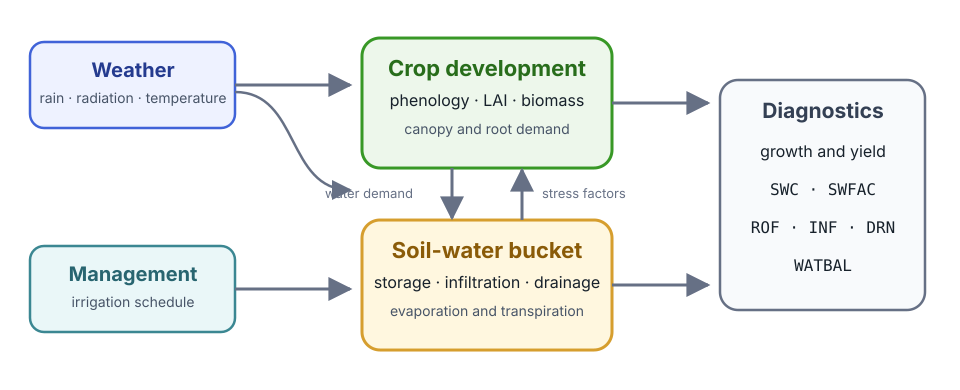

# [SimpleCrop](@id simplecrop-tutorial)

[SimpleCrop.jl](https://github.com/cropbox/SimpleCrop.jl) is a compact,
executable crop model assembled from phenology, canopy, biomass partitioning,
weather, and soil-water components. This tutorial follows the short integration
case in Cropbox's
[`test/examples/simplecrop.jl`](https://github.com/cropbox/Cropbox.jl/blob/main/test/examples/simplecrop.jl),
then reads its output from the perspective of the crop as a whole.

SimpleCrop follows the intentionally simplified model in the official DSSAT
teaching material, [*A Modular Approach to Structure Crop
Models*](https://dssat.net/wp-content/uploads/2014/03/modular.pdf). It is useful
for learning how components exchange values and how a complete simulation is
organized; it is not a fully parameterized production model.



*Weather and management supply the environment. Crop development, canopy,
biomass, and below-ground water balance advance together, while diagnostic
variables expose the resulting state.*

## Load the example inputs

The package test data contain daily weather and irrigation tables.

```@example simplecrop
using Cropbox
using SimpleCrop
using CSV
using DataFrames

loaddata(name) = CSV.File(
    joinpath(dirname(pathof(SimpleCrop)), "../test/data", name)
) |> DataFrame

weather = loaddata("weather.csv")
irrigation = loaddata("irrigation.csv")

(weather = first(weather, 3), irrigation = first(irrigation, 3))
```

The annotated CSV headers retain dates, units, and column types. Cropbox
normalizes them when the corresponding `provide` and `drive` variables are
constructed.

## Configure and run the model

```@example simplecrop
config = @config (
    Clock => :step => 1u"d",
    Calendar => :init => ZonedDateTime(1987, 1, 1, tz"UTC"),
    SimpleCrop.Weather => :weather_data => weather,
    SimpleCrop.SoilWater => :irrigation_data => irrigation,
)

result = simulate(SimpleCrop.Model;
    config,
    stop = :endsim,
)

(rows = nrow(result), start = first(result.DATE), finish = last(result.DATE))
```

This is the same execution path exercised by the framework test. `:endsim` is a
flag declared by the model, so the biological state rather than a hard-coded
number of days determines when the run stops.

## Read development and canopy growth

`N` is leaf number and `LAI` is leaf area index. They provide a quick check that
phenology and canopy development are advancing together.

```@example simplecrop
visualize(result,
    :DATE,
    [:N, :LAI];
    kind = :line,
)
```

The test suite plots `LAI`; displaying `N` beside it adds the developmental
context needed to interpret the canopy trajectory.

## Read biomass partitioning

`W` is total dry biomass. The component pools `Wc`, `Wr`, and `Wf` represent
canopy, root, and fruit biomass.

```@example simplecrop
visualize(result,
    :DATE,
    [:W, :Wc, :Wr, :Wf];
    names = ["Total", "Canopy", "Root", "Fruit"],
    kind = :line,
)
```

Read these curves together with development and `LAI`: a change in allocation
is part of the crop's developmental program, not just a final yield
calculation.

## Check one coupled environmental state

The integration test also plots stored soil water `SWC` divided by profile
depth `DP`.

```@example simplecrop
visualize(result,
    :DATE,
    :(SWC / DP);
    yunit = u"mm^3/mm^3",
    kind = :line,
)
```

This plot confirms that the environmental component is connected and evolving
during the crop run. It is not intended as a stand-alone validation of a
layered soil-water algorithm. For the separate multi-layer implementation in
Cropbox's own test suite, continue with [Soil Water Transport](@ref
soil-water-transport-tutorial).

## What this example establishes

The short test demonstrates the complete integration path:

1. tabular weather and management data enter through configuration;
2. a daily clock advances all model components;
3. phenology, canopy, biomass, and environmental states remain coupled;
4. a model-declared flag stops the simulation; and
5. the resulting table can be inspected or visualized without model-specific
   plotting code.

Use the model's own repository for cultivar parameters and scientific changes.
Use Cropbox's [configuration](@ref configuration-workflow),
[simulation](@ref simulation-workflow), and [visualization](@ref
Visualization1) pages for framework-level options.
