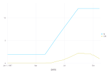
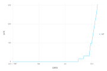
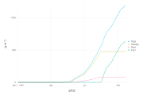
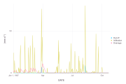
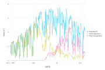
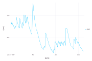
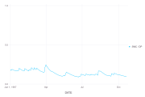
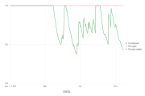
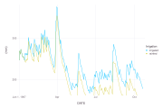

# [Soil Water and SimpleCrop](@id soil-water-tutorial)

This tutorial runs the soil-water component of
[SimpleCrop.jl](https://github.com/cropbox/SimpleCrop.jl) in the context of a
complete crop simulation. It shows how weather and irrigation tables enter a
model, how to inspect water fluxes, and how to check conservation before
interpreting water stress.

SimpleCrop follows the intentionally simplified modular crop-model example in
the official DSSAT materials: [*A Modular Approach to Structure Crop Models*](https://dssat.net/wp-content/uploads/2014/03/modular.pdf).
It is best used to learn component coupling and bookkeeping, not as a substitute
for a fully parameterized production model.


*Weather drives both crop development and the soil-water balance. Crop water
demand and soil-water stress couple the two components; the output variables
make that exchange auditable.*

## Load the model and its example data

SimpleCrop is already used by the Cropbox documentation environment.

```@example soilwater
using Cropbox
using SimpleCrop
using CSV
using DataFrames
using TimeZones
import Dates

loaddata(name) = CSV.File(
    joinpath(dirname(pathof(SimpleCrop)), "../test/data", name)
) |> DataFrame

weather = loaddata("weather.csv") |> unitfy
irrigation = loaddata("irrigation.csv") |> unitfy
(weather_rows = nrow(weather), irrigation_rows = nrow(irrigation))
```

Inspect column names and the first rows before constructing a configuration.

```@example soilwater
(first(weather, 3), first(irrigation, 3))
```

The CSV headers include type or unit annotations such as `DATE (:Date)` and
`IRR (mm/d)`. Calling `unitfy` once converts those columns and leaves the short
names `DATE` and `IRR`. This also avoids having several parallel scenarios try
to normalize the same shared input table during construction.

## Configure inputs and calendar

```@example soilwater
config = @config (
    Clock => :step => 1u"d",
    Calendar => :init => ZonedDateTime(1987, 1, 1, tz"UTC"),
    SimpleCrop.Weather => :weather_data => weather,
    SimpleCrop.SoilWater => :irrigation_data => irrigation,
)
typeof(config)
```

`weather_data` and `irrigation_data` are `provide(parameter)` variables inside
the model. Configuration supplies complete tables just as it supplies scalar
parameters.

## Inspect available parameters

```@example soilwater
model_parameters = parameters(SimpleCrop.Model; alias = true)
typeof(model_parameters)
```

For soil-specific work, inspect the relevant component rather than relying on a
very large recursive listing.

```@example soilwater
soil_parameters = parameters(SimpleCrop.SoilWater; alias = true)
typeof(soil_parameters)
```

## Run to the model stop condition

```@example soilwater
result = simulate(SimpleCrop.Model;
    config,
    stop = :endsim,
    target = [
        :DATE, :N, :INT, :LAI,
        :W, :Wc, :Wr, :Wf,
        :ROF, :INF, :DRN,
        :ETp, :ESa, :EPa,
        :SWC, :SWC0, :DP,
        :SWFAC, :SWFAC1, :SWFAC2,
        :TRAIN, :TIRR, :TESa, :TEPa, :TROF, :TDRN, :WATBAL,
    ],
)
size(result)
```

The model's `endsim` flag stops at its defined end of development. Explicit
targets make the analysis independent of unrelated variables added to the
model.

## Follow crop development and growth

Before diagnosing water stress, confirm that the crop itself advances through
the expected stages. `N` is leaf number, `INT` is reproductive thermal time,
and `LAI` is leaf area index. Plot thermal time separately because its dimension
is incompatible with leaf number and `LAI`.

```@example soilwater
visualize(result,
    :DATE,
    [:N, :LAI];
    kind = :line,
)
nothing
```



*Leaf number `N` and leaf area index `LAI` confirm that canopy development
advances before water-stress diagnostics are interpreted.*

```@example soilwater
visualize(result, :DATE, :INT; kind = :line)
nothing
```



*Reproductive thermal time `INT` is shown separately because it does not share
a dimension with the canopy variables.*

Total dry biomass `W` is partitioned among canopy `Wc`, root `Wr`, and fruit
`Wf`. Interpret the partitioning together with phenology and `LAI` rather than as
an isolated final-yield calculation.

```@example soilwater
visualize(result,
    :DATE,
    [:W, :Wc, :Wr, :Wf];
    names = ["Total", "Canopy", "Root", "Fruit"],
    kind = :line,
)
nothing
```



*Total dry biomass `W` and its canopy, root, and fruit components.*

## Follow water fluxes

```@example soilwater
visualize(result,
    :DATE,
    [:ROF, :INF, :DRN];
    names = ["Runoff", "Infiltration", "Drainage"],
    kind = :line,
)
nothing
```



*Daily surface runoff `ROF`, infiltration `INF`, and drainage `DRN`.*

Runoff, infiltration, and drainage should be interpreted alongside rainfall and
irrigation. A large drainage event is not necessarily an error if storage was
near capacity.

In this one-bucket model, the daily storage change can be read approximately as

```math
\mathrm{SWC}_{t+1} - \mathrm{SWC}_{t}
= \mathrm{INF} - \mathrm{ESa} - \mathrm{EPa} - \mathrm{DRN}
  - \text{overflow} + \text{underflow adjustment}.
```

Rainfall and irrigation first form potential infiltration. Surface runoff is
removed to give `INF`; water can then leave storage through soil evaporation
`ESa`, plant transpiration `EPa`, and drainage `DRN`. The overflow and
underflow terms keep storage within the implemented physical bounds.

Potential evapotranspiration `ETp` is determined from radiation, temperature,
and surface albedo. The model partitions that demand between soil and canopy,
then reduces the two potential fluxes to the actual `ESa` and `EPa` when water
is limiting:

```@example soilwater
visualize(result,
    :DATE,
    [:ETp, :ESa, :EPa];
    names = ["Potential ET", "Soil evaporation", "Plant transpiration"],
    kind = :line,
)
nothing
```



*Potential evapotranspiration `ETp` and the actual soil and plant components
`ESa` and `EPa`.*

## Soil water content and stress

Plot stored water depth:

```@example soilwater
visualize(result, :DATE, :SWC; kind = :line)
nothing
```



*Stored water depth `SWC` integrates the input and loss terms.*

Or convert it to volumetric water content using profile depth `DP`:

```@example soilwater
visualize(result, :DATE, :(SWC / DP);
    yunit = u"mm^3/mm^3",
    kind = :line,
)
nothing
```



*Dividing stored water depth `SWC` by profile depth `DP` gives volumetric
soil-water content.*

The stress factors summarize different limitations:

```@example soilwater
visualize(result,
    :DATE,
    [:SWFAC, :SWFAC1, :SWFAC2];
    names = ["Combined", "Drought", "Excess water"],
    ylim = (0, 1),
    kind = :line,
)
nothing
```



*The combined stress factor `SWFAC` follows the more limiting drought or
excess-water component.*

`SWFAC1` approaches zero as storage approaches the wilting range. `SWFAC2`
approaches zero when the simulated water table is too shallow. `SWFAC` uses
the more limiting of the two, and plant transpiration is reduced by that
combined factor. Do not interpret it without checking storage and the fluxes
that produced it.

## Check the water balance

The final cumulative values provide a compact audit.

```@example soilwater
last = result[end, :]
(
    initial = last.SWC0,
    final = last.SWC,
    rain = last.TRAIN,
    irrigation = last.TIRR,
    soil_evaporation = last.TESa,
    transpiration = last.TEPa,
    runoff = last.TROF,
    drainage = last.TDRN,
    balance = last.WATBAL,
)
```

The reported residual is

```math
\mathrm{WATBAL}
= (\mathrm{SWC}_0 - \mathrm{SWC}_{final})
  + (\mathrm{TRAIN} + \mathrm{TIRR})
  - (\mathrm{TESa} + \mathrm{TEPa} + \mathrm{TROF} + \mathrm{TDRN}).
```

It should be close to zero apart from numerical tolerance. `WATBAL` is an
audit residual, not the amount of water remaining in the soil. Check
conservation before adjusting stress parameters. A nonzero residual can come
from inconsistent units, incomplete input coverage, an unintended time step,
or an incorrect initial condition.

## Compare irrigation scenarios

Create a modified irrigation table rather than mutating the base table in place.

```@example soilwater
irrigated = copy(irrigation)
events = (Dates.year.(irrigated.DATE) .== 1987) .&
    (Dates.dayofyear.(irrigated.DATE) .% 14 .== 0)
irrigated.IRR[events] .= 20u"mm/d"

rainfed = copy(irrigation)
rainfed.IRR .= 0u"mm/d"

configs = [
    @config(
        config,
        SimpleCrop.SoilWater => :irrigation_data => irrigated,
        :Scenario => :name => "irrigated",
    ),
    @config(
        config,
        SimpleCrop.SoilWater => :irrigation_data => rainfed,
        :Scenario => :name => "rainfed",
    ),
]

comparison = simulate(SimpleCrop.Model;
    configs,
    stop = :endsim,
    target = [:DATE, :SWC, :SWFAC, :LAI],
    meta = :Scenario,
)
(rows = nrow(comparison), scenarios = unique(comparison.name))
```

The irrigation table's value column is `IRR`; always inspect `names(irrigation)`
instead of assuming a generic name such as `amount`. Here, `events` schedules
20 mm every 14 days during 1987 so the comparison is deliberately visible.
The actual model parameter
uses the system type `SimpleCrop.SoilWater`, which validates its name. The
symbol `:Scenario` is intentional: it is metadata only and is not consumed by
the model. This avoids copying a complete input table into every output row.

Split the combined table by `name` when plotting so the treatment identity
stays visible:

```@example soilwater
let p = nothing
    for scenario in unique(comparison.name)
        selected = comparison[comparison.name .== scenario, :]
        p = visualize!(p, selected, :DATE, :SWC;
            name = scenario,
            legend = "Irrigation",
            kind = :line,
        )
    end
    nothing
end
```



*The scenario metadata keeps irrigated and rainfed soil-water trajectories
separate without adding a model parameter.*

For larger scenario designs, see [Configure Models and Scenarios](@ref
configuration-workflow) and [Simulation](@ref Simulation1).

## From one bucket to layered soil

Cropbox's framework tests also contain a layered water-balance example. It uses
the same DSL patterns at a lower level:

- `interpolate` and `call` for hydraulic curves;
- `track` for conductivity, matric head, and fluxes;
- `accumulate` for layer water storage;
- `ref` for flux values written by interfaces;
- nested paths such as `"soil.layers[1].water_content"` for output.

That example contains research notes and provisional bounds, so it should be
treated as an implementation study rather than a packaged production model.
The transferable lesson is to validate each layer's units, bounds, and mass
balance before coupling it to crop demand.
